# Flows

The service in diagrams. Each one shows something the prose says at length, and
links to where the reasoning lives.

Rendered by GitHub directly — no images to regenerate when the code changes,
and the source is reviewable in a diff.

---

## The whole thing in one picture

One transaction, nothing going wrong. Everything below is a detail of this.

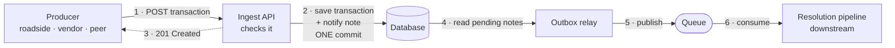

**Steps 1–3 are synchronous** — the producer waits and gets an answer.
**Steps 4–6 happen afterwards**, on their own, usually within a second or two.

The load-bearing detail is step 2: the transaction and the note telling the
pipeline about it are saved **together**. There is no moment where one exists
without the other, which is why a crash can delay a notification but never lose
one.

Step 4 is a poll, not a push — the relay asks the database for unpublished
notes every couple of seconds. Nothing has to tell it.

---

## 1. Who talks to what

Four producers, one endpoint, one downstream consumer. The resolution pipeline
is named because the contract names it, not because this service implements it.

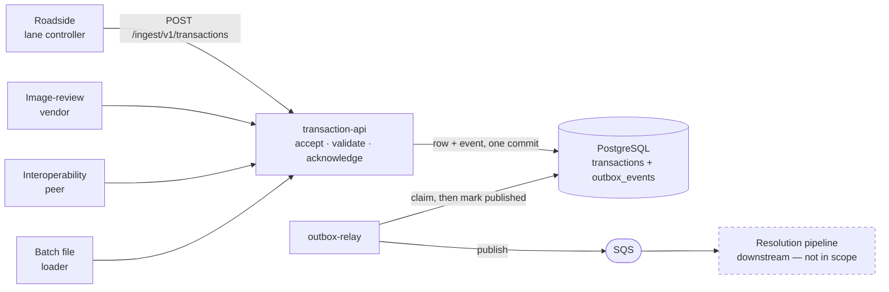

Two of the four producers submit **late** — image review and batch loading
happen well after the vehicle passed. Two of the four **resubmit** — retries
over unreliable links, and whole files replayed. That is why there is no
posting window and why ingest is idempotent.

→ [docs/domain.md](domain.md)

---

## 2. What happens to a request

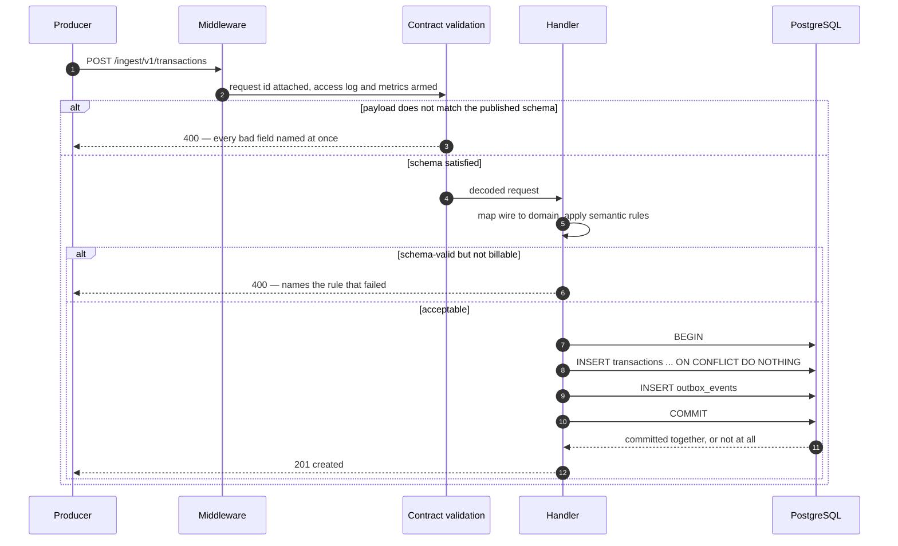

The handler never sees a malformed body: contract validation runs as
middleware, before it. And the transaction row and its event are one commit —
step 9 is the whole point of the outbox.

→ [docs/architecture.md](architecture.md)

---

## 3. Three layers of validation

The contract's own `400` description names failures no JSON Schema can
detect — *"no usable identifier, unrecognized transaction_type, or an
unparseable amount"* — which is a strong hint this shape is expected.

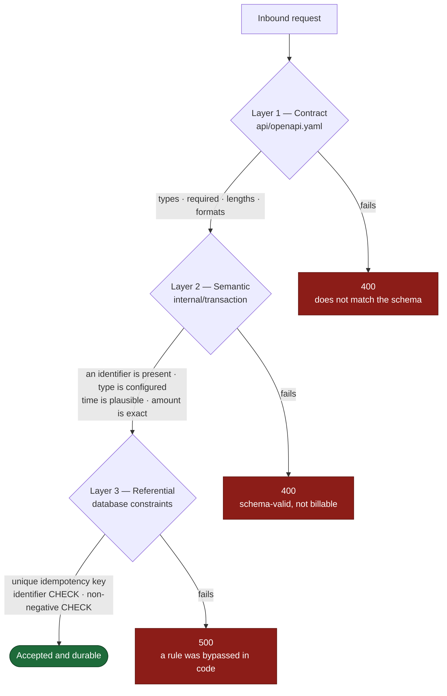

Layer 3 is not redundant. Application validation produces the *actionable
message*; the constraint is the *guarantee*. A future code path that skips the
rules still cannot write an unbillable row.

→ [ADR-0003](adr/0003-layered-validation.md)

---

## 4. 🔑 Idempotency, and the case the contract leaves open

The diagram worth the most attention. Both right-hand branches return the same
thing to the producer — and only one of them is silent.

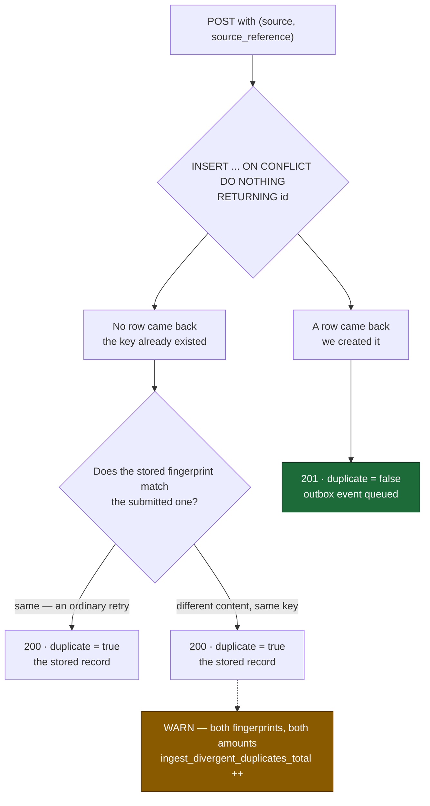

The contract defines **no conflict status**, and a producer coded against it
has no branch for one — so a key match always answers as a duplicate. But a
differing payload under an existing key is either a producer defect or an
attempt to change an amount the contract calls immutable.

Answering `200` and dropping the difference on the floor is what a literal
reading produces, and it is the one option that is indefensible.

→ [ADR-0006](adr/0006-idempotency-divergence.md) — **the top thing to discuss**

---

## 5. An outbox event's life

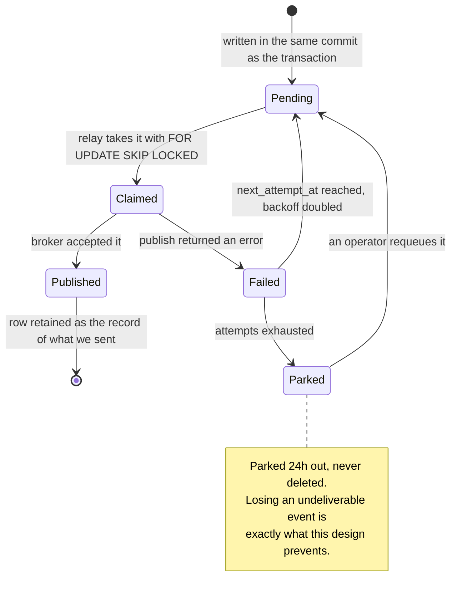

`SKIP LOCKED` is what lets relay replicas partition the backlog instead of
double-publishing it or queueing behind each other. The cost of the whole
design is **at-least-once** delivery — consumers deduplicate on `event_id`.

→ [ADR-0007](adr/0007-transactional-outbox.md)

---

## 6. Two status axes, not one lifecycle

The sharpest piece of modelling in the contract, and the easiest to get wrong.

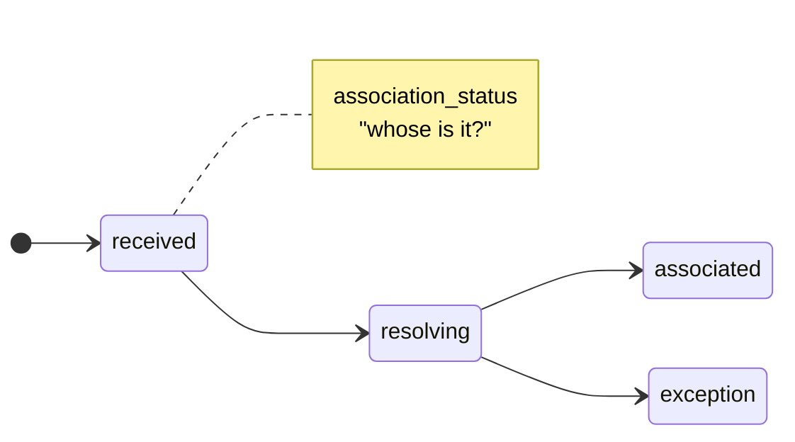

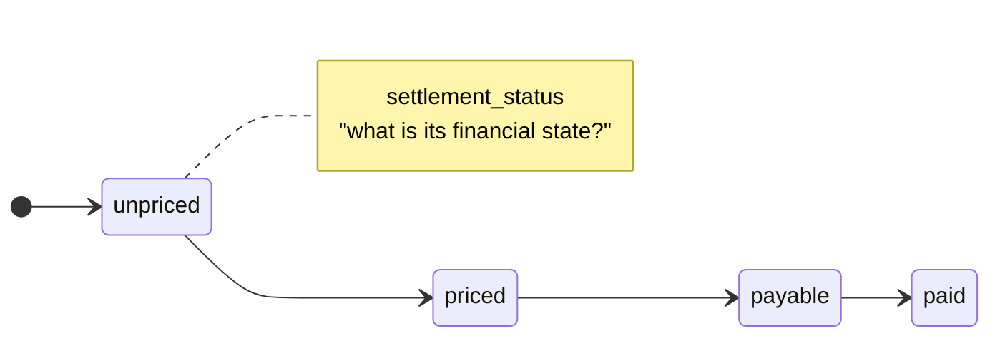

They advance **independently**. A single collapsed enum cannot represent an
unidentified vehicle with a known toll amount — and that is not an edge case,
it is video tolling, and a large share of revenue.

Every freshly ingested transaction is `received` **and** `priced`.

→ [docs/domain.md](domain.md)

---

## 7. What gets stored

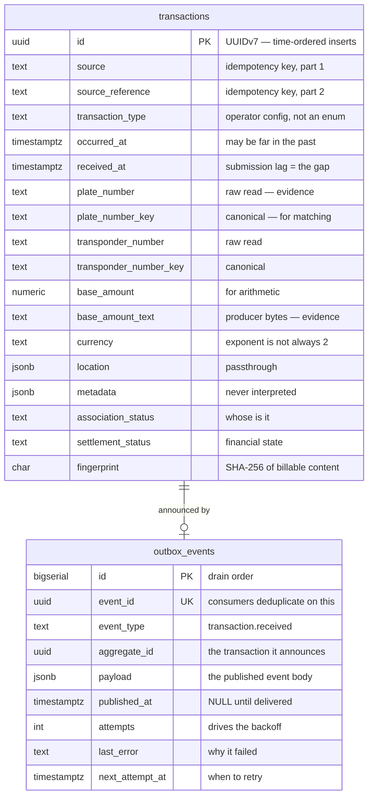

Three things are stored twice on purpose:

| Stored twice | Why |
|---|---|
| Amount — `numeric` **and** the producer's text | One for arithmetic, one for the dispute |
| Plate — raw **and** canonical | One is evidence, one is a lookup key |
| Transponder — raw **and** canonical | Same, and leading zeros are deliberately preserved |

The relationship is **logical, not a foreign key**. Constraining it would
couple outbox retention to transaction retention, and they have different
lifetimes.

→ [ADR-0004](adr/0004-exact-decimal-money.md) ·
[ADR-0009](adr/0009-identifier-canonicalization.md)

---

## 8. Releasing a version

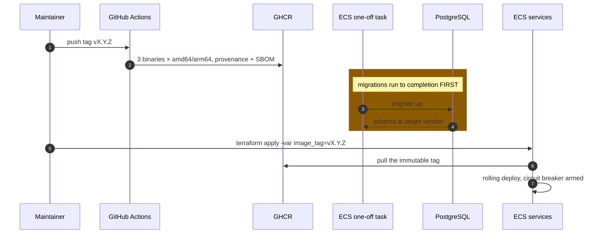

Migrations are **never** in the service's startup path. Rolling tasks would
race the same DDL, and a scale-up during an incident must not alter the schema.

No `latest` tag is published — a rollback needs a reference that cannot move,
and the Terraform rejects `latest` as an `image_tag` for the same reason.

→ [deploy/terraform/README.md](../deploy/terraform/README.md)

---

## 9. How changes reach `main`

Branches are created with `git flow`; they are **merged through pull requests**
rather than `git flow finish`, which merges locally and skips both CI and
review.

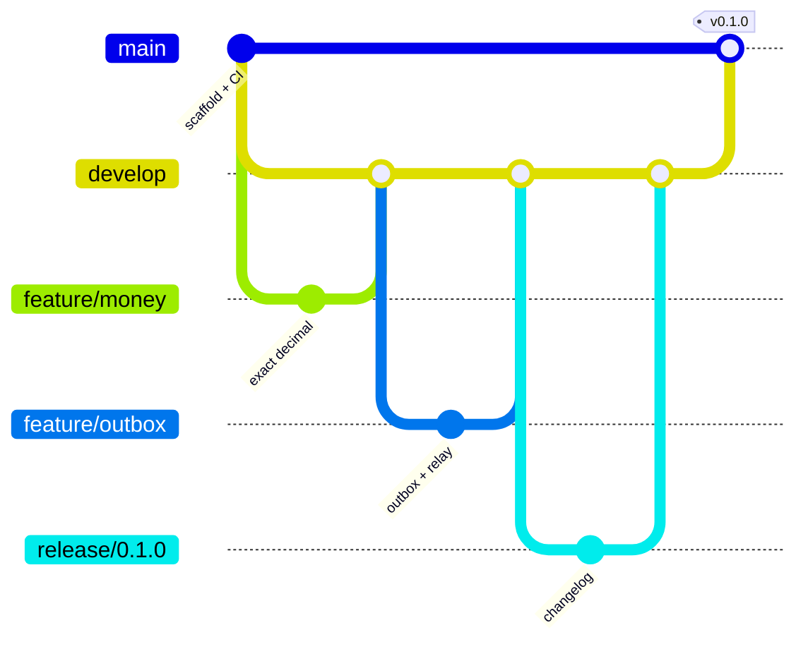

Features squash into `develop`, so it stays linear and each PR is one commit.
The release merges into `main` as a **merge commit**, so `main` carries the
whole history rather than one flattened blob.

→ [CONTRIBUTING.md](../CONTRIBUTING.md)
